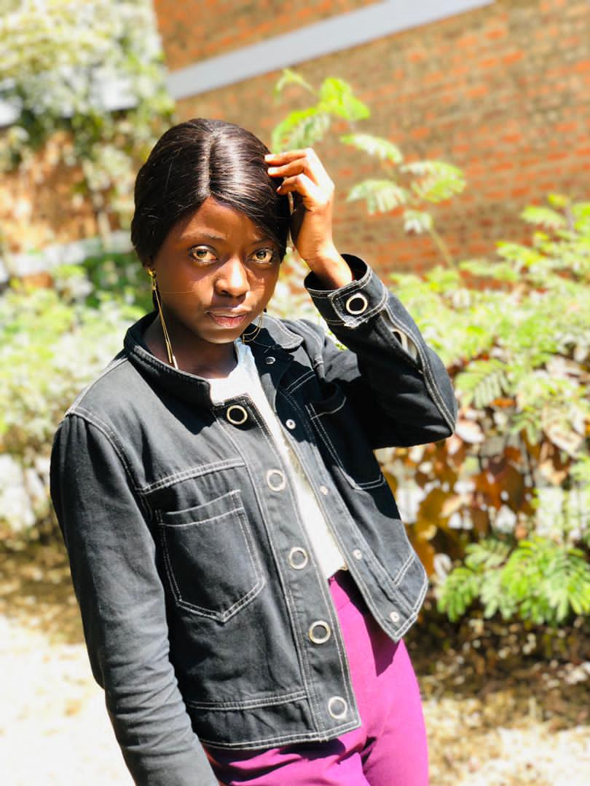

<!DOCTYPE html>
<html>
<head>
   <title>About MWANZA NSENGA Diegra </title>
</head>
<body>
   <header>
      <nav>
         <h1> MWANZA NSENGA Diegra  </h1>
         

            <a href="adresse.html"> Adresse </a> |
            <a href="contacts.html"> Contacts </a> |
            <a href="etudes.html"> Etudes </a> |
            <a href="preference.html"> Preferences/Caractère </a>
         

      </nav>
   </header>
    
   

   <main>
      <h1 align="center"> Tout me concernant </h1>
      
      
 il nous a été demander de faire une petite biographie sur notre personne dans le cours de programmation web,  
         je prenomme MWANZA NSENGA Diegra, fille de KAYUMBA Jeanson et NSHIMBA Germaine  née à Likasi le 28 Novembre 2002 dans une famille de 7 enfants où j'occupe la sixième place. je suis etudiante à l'école supérieur d'informatique Salama ESIS  en première licence. 

      
Pour ce qui est des études, j'ai eu à effectuer trois cycles d'etudes complet c'est-à-dire maternelle, primaire et sécondaire. et actuellement entrain de poursuivre le quatrième dans les sciences informatiques. 

      
 J'ai grandi dans une famille chrétienne où j'ai vraiment appris de l'existence de Dieu. Et à l'age de 15ans j'ai donné ma vie au Seigneur afin de le servir et vivre pleinement selon son dessein. Actuellement je suis chantre à l'église Germe de David. 

   </main>
</body>
</html>

